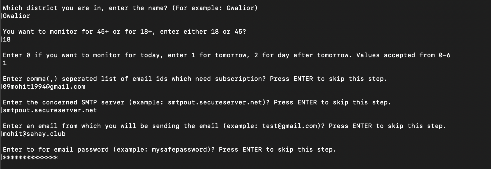
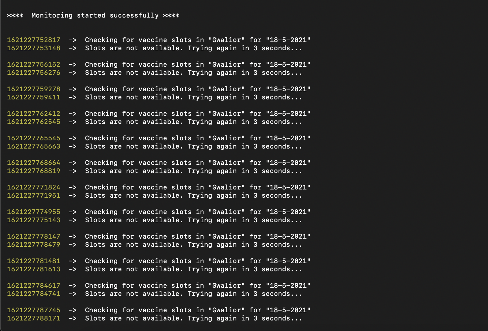

# Cowin vaccine availability tracker

This is a small program to subscribe to vaccine availability as it becomes available in the government's database. The user is notified via email. Email credentials need to be filled in by the user.

- If email is not configured, notifier falls back to OS notifications

# Download for MacOS, Windows and Linux
[Linux](https://drive.google.com/file/d/1AL65JV1_FSxtDQpa7sR8eEsXFsQih9tw/view?usp=sharing)
[MacOS](https://drive.google.com/file/d/1OzoGy-cgyxnTxtBOSCEhezEe6kUJOqER/view?usp=sharing)
[Windows](https://drive.google.com/file/d/1-0gOUUCQgUfXyKoomGhnz3Wq2mEKaWcT/view?usp=sharing)

## Configure subscription details

After starting the app, this is how we can configure it



Subscription in Action



## Installation

Use the node package manager [npm](https://nodejs.org) to install the dependencies.

```bash
npm install
```

## To generate binaries (executables) for MacOs, Windows and Linux

```bash
# if pkg is not installed globally, install using npm and if already installed ignore command below
npm i -g pkg

# to generate executables
npm run package
```

## Contributing

Pull requests are welcome. For major changes, please open an issue first to discuss what you would like to change.

## License

[MIT](https://choosealicense.com/licenses/mit)
